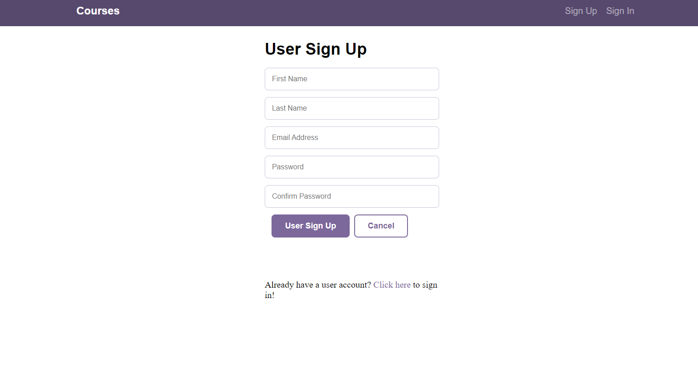
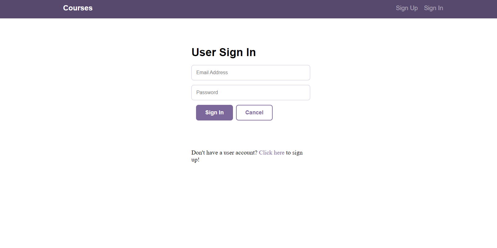

<h1 align="center">Full-Stack-APP/ Courses Manager</h1>

## Description
This is a Full stack application empowering users to view a list of courses and the detail for a specific course. Users can sign up to create an account or sign in with an existing account, and create, update, or delete courses.

## Technologies
* CSS
* HTML
* Node.js
* Sequelize
* Express
* React
* React Context API


## Table of Contents

- [Installation](#installation)
- [Usage](#usage)
- [Screenshot](#screenshot)
- [License](#license)

## Instructions

If you would like to run the project locally clone or download the master branch and follow these instructions.

### Node.js

To get up and running with this project, run the following commands from the root of the folder that contains this README file.

Go to the /api directory.

```
cd api
```

First, install the project's dependencies using `npm`.

```
npm install

```

Second, seed the SQLite database.

```
npm run seed
```

And lastly, start the application.

```
npm start
```

To test the Express server, browse to the URL [http://localhost:5000/](http://localhost:5000/).

### React.js

Open a second terminal and type:

```
cd client
```

In the project directory, you can run:

```
npm install
```

This will install all dependencies

Then type:

```
npm start
```

Runs the app in the development mode.<br>
Open [http://localhost:3000](http://localhost:3000) to view it in the browser.


## Usage
Live link [here](https://coursefinder111.herokuapp.com)


## Screenshots




## License
[](https://opensource.org/licenses/MIT)<br>
This project is licensed under the MIT License - see the [license info](https://opensource.org/licenses/MIT) for more details.
